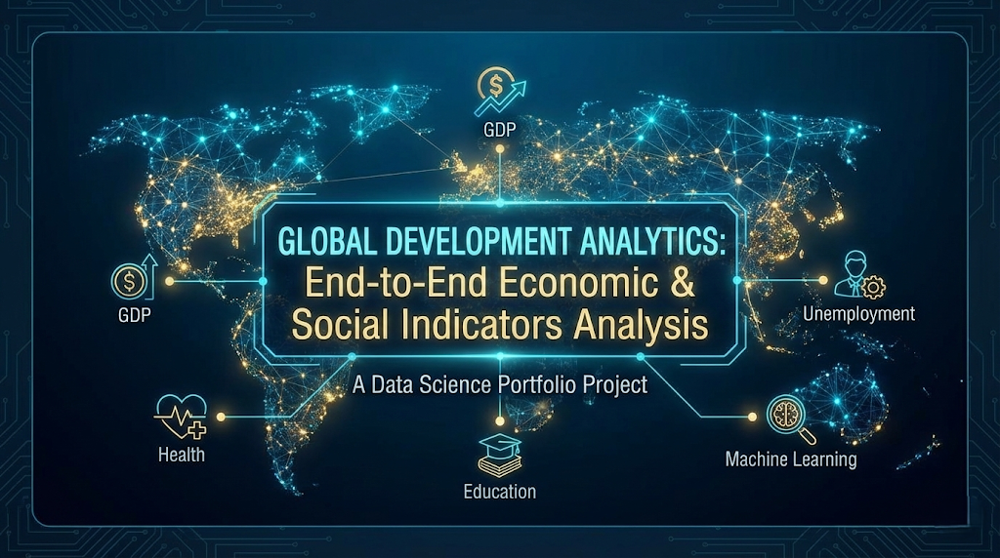
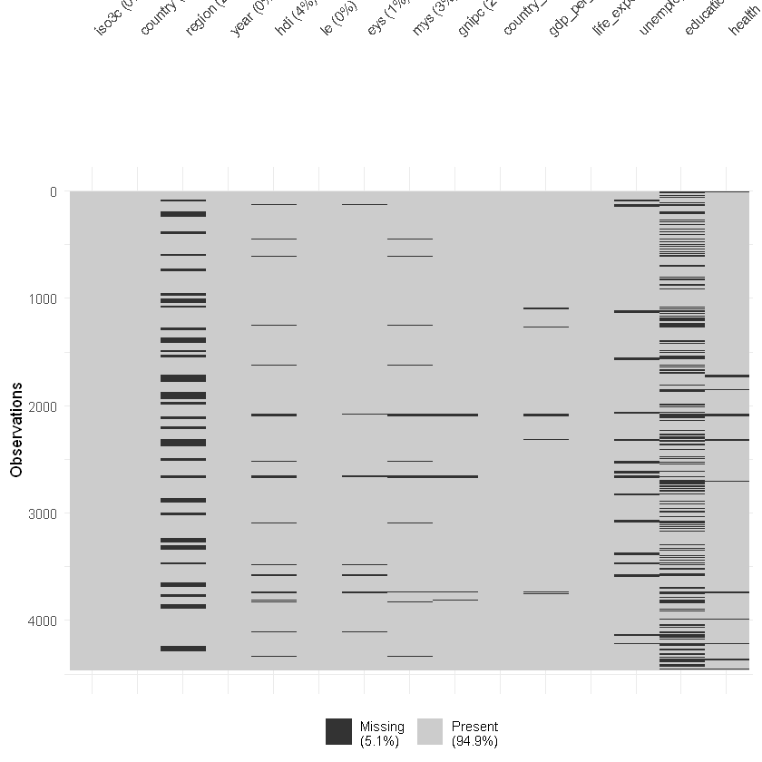
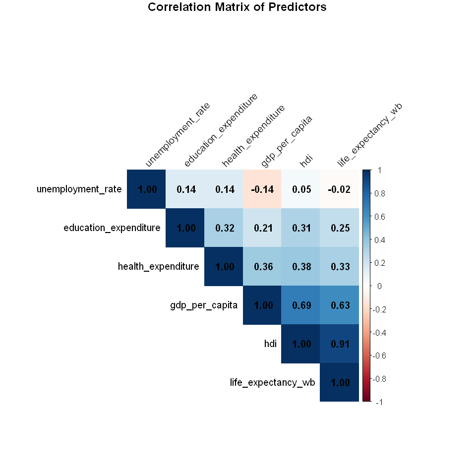
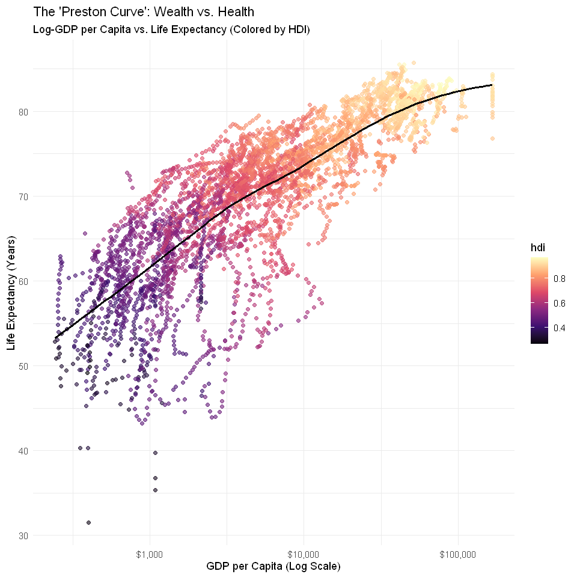
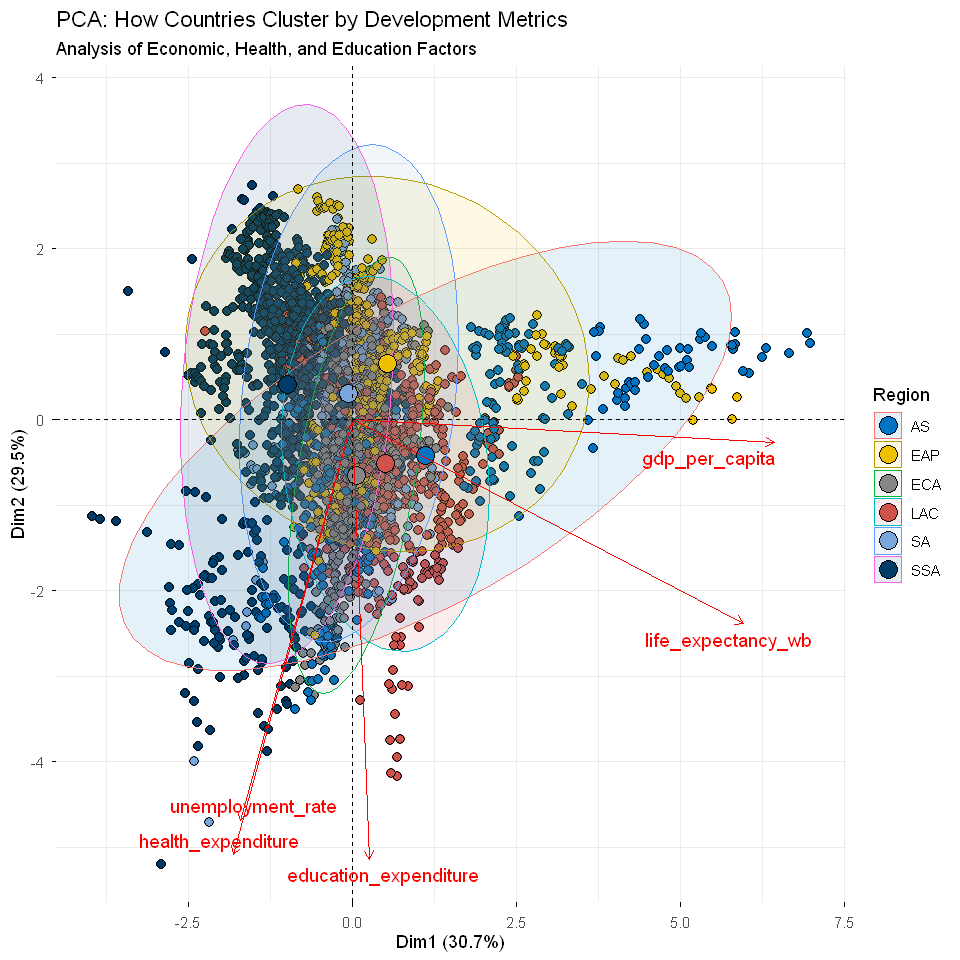
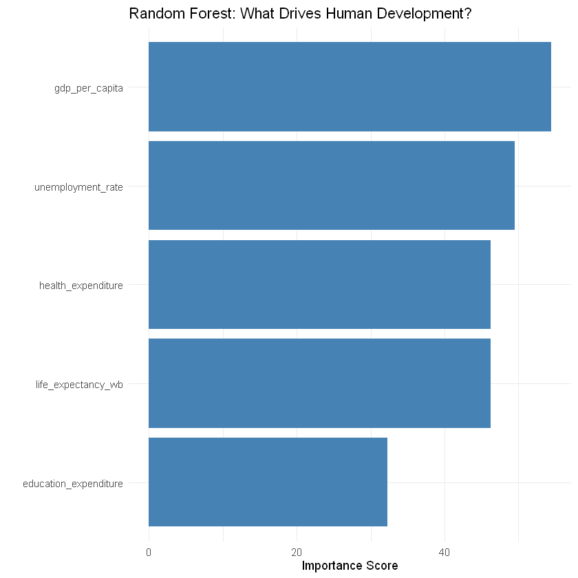

<div align="center">
  <a href="report.pdf">
    
  </a>
  <p><em>Click the banner to view the full analysis report</em></p>
</div>

# 🌍 Global Development Analytics  
### An End-to-End Data Science Project in R

---

## 🚀 Overview

This project delivers an **end-to-end data science analysis** of the key drivers behind the **Human Development Index (HDI)** across **180+ countries from 2000 to 2022**.

Going beyond descriptive statistics, the study integrates **economic theory**, **robust data engineering**, and **predictive modeling**, comparing traditional econometric approaches (**Linear Regression**) with machine learning methods (**Random Forest**) to uncover **non-linear dynamics in global development**.

The result is a reproducible, research-grade workflow suitable for **policy analysis, academic research, and applied data science portfolios**.

---

## 📊 Key Visualizations

### 1️⃣ Data Quality & Correlation Structure

| Data Quality & Imputation | Correlation Analysis |
|:---:|:---:|
|  |  |
| *Group-wise imputation of missing time-series data.* | *Strong correlation (0.91) between Life Expectancy and HDI.* |

---

### 2️⃣ Economic & Structural Insights

| The Preston Curve | Structural Clustering (PCA) |
|:---:|:---:|
|  |  |
| *Diminishing returns of GDP on Life Expectancy.* | *Distinct regional and income-based development clusters.* |

---

## 🧠 Modeling & Results

### 📈 Model Performance

- **Linear Regression (Baseline):** RMSE = 0.056  
- **Random Forest (ML):** RMSE = 0.026  
- **Performance Gain:** **54% improvement** in predictive accuracy

➡️ This confirms that **human development follows non-linear patterns** poorly captured by linear models.

---

### 🔍 Feature Importance (Random Forest)



**Key Drivers of HDI:**
1. GDP per Capita (Primary Driver)
2. Life Expectancy
3. Health Expenditure
4. Unemployment Rate (Critical bottleneck effect)

---

## 📊 Key Findings

- **Machine Learning Superiority:** Random Forest significantly outperforms traditional regression, highlighting complex interactions in development indicators.
- **Preston Curve Validated:** Economic growth yields diminishing returns on health and human development after a threshold.
- **Policy-Relevant Bottlenecks:** Health spending and labor market conditions meaningfully constrain development outcomes beyond income alone.
---
## View the Report

📄 **[View Full Analysis Report](https://htmlpreview.github.io/?https://github.com/sanaurrehmanarain/human_development_index_R/blob/main/report.html)** - Download `report.html` and open in your browser for the complete interactive report with all visualizations and code.
---

## 🛠️ Tech Stack

### 🔧 Language
- **R (4.x)**

### 📦 Data Engineering
- `tidyverse`, `janitor`
- `WDI` (World Bank API)
- `naniar` (Missing data diagnostics & imputation)

### 📊 Visualization & EDA
- `ggplot2`, `GGally`
- `corrplot`
- `factoextra` (PCA & clustering)

### 🤖 Modeling
- `tidymodels`
- `randomForest`
- `vip` (Model interpretability)

### 🌐 Data Sources
- World Bank Open Data API  
- UNDP Human Development Reports

---

## 💻 How to Run the Project

1. **Clone the repository**
   ```bash
   git clone https://github.com/your-username/global-development-analytics.git
    ```
2. Open `human_development_index_R`

3. Run data collection:
    ```r
    scripts/01_data_collection.R
    ```
4. Generate the full report:
    ```r
    rmarkdown::render("report.Rmd")
    ```
---
## 📂 Project Structure
---
```text
├── data/            # Raw and processed datasets
├── scripts/         # Modular R scripts (ETL, EDA, Modeling)
├── results/         # Figures and model outputs
├── report.Rmd       # Reproducible analysis report
├── mega-hdi-analysis.Rproj
└── README.md        # Project documentation
```
⭐ If you find this project useful, feel free to star the repository or reach out for collaboration.
 
